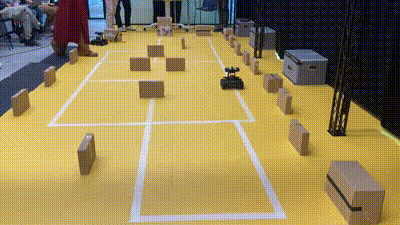

# Fruit Ninja - Rosbot 2 Pro Edition

The purpose of this project is to follow a white line whilst avoiding obstacles and classifying fruit objects from the [freshie fruits dataset](https://universe.roboflow.com/freshie/freshie-fruits)

<p align="center">
  
</p>

# Demo Videos

<p align="center">
  
</p>
<p align="center">
  
</p>


# Instructions to run

ROS Version: Noetic - [Installation Instructions](https://wiki.ros.org/noetic/Installation/Ubuntu)

Notice that the Computer Vision model for fruit classification is running in a remote PC for faster inference. On the other hand, the line_follower is running locally on the robot to avoid delays caused in the transmission of the camera topics to the remote PC.

### Step 1: Connect remote computer to run object detection model:

```bash
export ROS_MASTER_URI=http://{ROSBOT_IP}:11311
export ROS_IP={LOCAL_BROADCASTED_IP}
```

### Step 2: Set Rosbot's env variables to broadcasted IP:

```bash
export ROS_MASTER_URI=http://{ROSBOT_IP}:11311
export ROS_IP={ROSBOT_IP}
```

*** When the env variables are localhost the robot won't stream ROS and it will be a loopback address


### Step 3: Run `line_follower` locally in the robot
```bash
cd catkin_ws
cd src
git clone https://github.com/dsanmart/rosbot-2-pro.git
cd ..
catkin_make --only-pkg-with-deps rosbot_2_pro
source devel/setup.bash
roslaunch rosbot_2_pro vision.launch
```

### Step 4: Run `vision` in the PC with enough space for the CV model

```bash
ssh username@{ROSBOT_IP}
cd catkin_ws
cd src
git clone https://github.com/dsanmart/rosbot-2-pro.git
cd ..
catkin_make --only-pkg-with-deps rosbot_2_pro
source devel/setup.bash
roslaunch rosbot_2_pro line_follower.launch
```

#### Dependencies:
- `gmapping` for the odometry visualization in `rviz`
```bash
sudo apt install ros-noetic-slam-gmapping
```
- `ultralytics` for the yolo prediction model
```bash
pip install ultralytics
```
